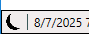

# What is this application?

At its core this application is designed to provide an easy way to backup and restore world and character save files for Enshrouded. There are two variations of this application. One for Clients (the normal game), and one for Dedicated Servers (running locally on your computer).

There are some additional features in the Client mode such as:

- Exporting and importing single characters between saves

- Clearing the fog of war for a character.

Additional features for both modes:

- Rollback UI for rolling back the index for the rolling saves

- Bug report zip packager for saves and logs

Server mode provides an additional feature to allow editing of the server configuration JSON file in a UI.

# Getting Started

This application is written in C# .NET 8 so the runtime for that is required. Many users of Windows 11 will probably already have it installed. If you do not have a compatible runtime installed you will need to get it from [Download .NET 8.0 (Linux, macOS, and Windows) | .NET](https://dotnet.microsoft.com/en-us/download/dotnet/8.0). You will need the package in the `.NET Desktop Runtime` section. If you do not have the proper runtime installed you will receive a message like the following when launching.


This application was developed for and has only been tested on Windows. So use with other platforms may or may not work.

It should first be noted that **the game should be closed** prior to and while using this application. This application does not watch for and automatically update itself as files are modified by the system. So you could end up with out of sync and mismatching things if you operate this application while the game is running.

There is a refresh button on most of the UI pages to allow you to ask the program to look at the folders again and update accordingly which should work around some of the issues that occur by running the game while this application is open. However changes made do not always show up in game unless it is restarted.

While the concept of this application is to make managing of your saves easier. It does expect you have some idea of how things work. To that there are some websites with information to explain that. Saraserenity has some of the more widely referenced information here in the [Enshrouded Guides](https://saraserenity.net/enshrouded/). 

# First Run

When first launching the application it will have no prior folder locations saved. This means it will not show any saves or permit backups since it doesn't know where these things are. You must first use the folder select buttons to set each folder.

On first run in the client mode it will provide a folder selection window where it detects any existing Steam cloud save paths as well as the local Save Game folder for non cloud saves. If you know none of those to be what you want you can use the custom select option to get a folder browser window and navigate to where you want.

On first run in server mode it will look in the Windows registry for the Steam uninstall data to auto fill the server path. Most of the time this will be correct. If it is not then you will need to manually select the folder. In server mode you will also need to ensure that you have a valid config JSON file which points to a valid folder for the save files.

Next you would want to set the backup folder path. This is the place where your backups will be placed.

Once you have the server/save game path and the backup path set. You should be able to see any existing save slots that are in use.

# Dark Mode

This application has a dark mode. You can enable and disable it via the toggle button in the bottom left corner next to the status bar.

 

# Creating Backups

Since the game uses rolling saves and has a pointer file to identify which of those is in use. This application reads that pointer file and will only show the relevant recent files for a given slot. These are the ones which will be backed up when pressing the relevant button. This is limited in such a way because there is no way to correlate which pair of rolling files match up with each other otherwise. In other words, the backup archive will only hold the most recent of the rolling save files. This is generally sufficient.

To create a backup it is quite simple. You can either backup all save slots by pressing the `Backup All` button or you can select any number of slots manually. You can multi select by holding the control key and clicking a slot. Then use the `Backup Selected` button.

Backups are created on a per slot basis. So if you have slot 1 and 2 for worlds used. You will end up with 2 zip files pertaining to those slots.

# Restoring Backups

Restoring backups is only permitted one slot at a time. This is because there is an option to override the target slot. So if you originally backed up from slot 1. You could now restore it to a slot of your choosing between 2 and 10. Effectively creating a duplicate.

- **Note:** If you duplicate worlds in this way you will have the same name for both. You should rename one of them from inside the game to be able to easily identify which is which.

This also works to take world saves from a client and restore to a server. Since the client may have used a world other than slot 1 and the server only supports slot 1.

Restoring a world save from a server to a client has some quirks. Primarily that an info file has to be created from scratch. So I've set it to use a `Default` difficulty and set the name as `NewWorld`. See the Technical Details below for more information on all the quirks. The short of it is that it works and just has visual inconsistencies in the status until you load the world once.

When restoring and the save slot is already in use you will receive a choice to override. If you want to skip the confirmation and always override you can hold the shift key when clicking the restore button. When an override is necessary, any files for the chosen slot are deleted and placed in the recycle bin. This includes all rolling backups.

The restore tab will list **exported** character and world files from the tools tabs which are not backups. They will be identified as **invalid** on the restore tab. However this is only in the context of restoring as a backup. They can still be used to import on their respective tab.

You can also take archives from a resource world provided they are in zip format, otherwise they must be converted first. So the files from Awesome Armory, PRW, or Shroud Depot and can be placed in the backup folder. You can then restore them to any slot you want. Any other archive should also work as long as only one world slot worth of files is inside the zip.

Some things to note about using archives from other sources:

- If the archive contains more than one world slot of files it will be marked invalid and cannot be restored with this application. The UI will state how many worlds it found in the zip. You could still manually unzip it.

- If the archive contains a world slot file and characters file, it will only be permitted to restore to the original slot. This is due to the requirement that characters must be restored to that specific slot.

After the restore is completed there will only be a single pair of files for the slot or characters. Or for Server mode just a single file.

# Server mode

The server config editor has tooltips on most values to help explain what they mean. These are taken from the official site https://enshrouded.zendesk.com/hc/en-us/articles/20453241249821-Server-Gameplay-Settings

The values stored in the JSON file are floating point values. However for simplicity this application will show them using percentages on the sliders to emulate what you would see in game. You will also have more granular range selection than what is found in game. For example if in game you could set a value of 50/100/200/300/400, in the application you could set all increments of 50 like 50/100/150/200/etc.

Most names of sliders match what is in game, or are very similar to make it easier to identify them. This means they may not reflect the underlying JSON named key. For example in the JSON the key `aggroPoolAmount` reflects what the game shows as `Simultaneous Enemy Attacks`. So the UI for this application shows it as `Simultaneous Enemy Attacks`. This is so someone configuring a world to or from a server in the other platform can more easily re-create a custom difficulty by just matching up the values.

The named values for such things like the aforementioned `Simultaneous Enemy Attacks` in game are listed as `Easy/Default/Hard/Very Hard` but in the JSON it is stored as `Few/Normal/Many/Extreme`. For the sake of simplicity in writing this application, the UI will show the JSON stored value in the drop down lists.

The config editor has obvious load, new, and save buttons. The save button is on the bottom intentionally so as to not accidentally click save when you mean to load or make a new config or similarly the opposite.

When saving the JSON, a backup is always made. The old config file is renamed and the new one created in its place. If for some reason you wish to make a save with a different name you may hold control and click the save button. This funcions like a "Save As" feature. If you specify a file that already exists, the select window will prompt if you want to overwrite. Though a backup will still be made.

You may also load a config file from a non standard filename or location by holding control and clicking on the load button.

# Tools

Before doing anything with the extra tools in this application. Make sure you have a recent backup. All of the tools will operate directly on the "current" save as specified by the index file.

This application provides some limited save file editing tools.

- Selective character import/export

- Selective character fog of war clear/reset

- World export/import

There is also a rollback tab to provide a method to change which save file is used from the 10 minute rolling saves.

The Bug Report tab is designed to ease the gathering of log files and all saves when requested by the Keen team. It provides a quick and easy way to package it all up with one click.

### Character Tools

The Character tab inside the tools section permits exporting and subsequently importing characters into the save file. The game permits a maximum of `16` characters. There is the option to remove selected characters by right clicking and choosing delete.

**Duplicating a character:**

- You can duplicate a character by exporting and then importing it again. Duplicating a character in this way will result in both having the same name, though they will have different internal IDs so they will be treated as different. You should rename one of them to make it easier to identify which is which.

**Export:**

- You can select multiple characters for export using the control key when clicking on the character. When clicking the export they will each be exported to their own individual zip file.

**Import:**

- When you import you are provided a file selection dialog. You may select multiple files. If you select any files which are not proper exported characters you will receive a messagebox for each of them stating such an error.

**Fog of war:**

- The options for clearing or resetting the fog of war simply set the masking image to full transparent or full opaque. This must be done one character at a time. When selecting a character you will be provided an image showing what the current fog looks like. White is the visible area, while black is the hidden area.

**Remember to Save:**

- All of the Character tools are done in application memory. So as such, nothing is actually saved until you click the save button.

### World Tools

The World tab inside the tools section is quite frankly of limited use. I've provided it as a way to assist those who might have use for it in reverse engineering the data formats. That said, I have provided the facility to export the BLOBs related to a world save to a zip, and subsequently import them back.

**Importing:** When importing, you will be replacing the currently selected world data with that from a provided zip. You are provided a dialog box to pick an exported zip. When doing so **it will overwrite the selected world save immediately without confirmation**. The name and such data is not stored in the export so that remains the same regardless of what world data is imported.

### Rollback Tools

The Rollback tab in the tools section simply assists in modifying the index files so a user doesn't need to edit them manually. When you select a save slot, you are provided a file list of the character saves, base world saves, or the world info files. They are sorted by timestamp so the most recent is on the top. There is a checkmark next to the file which is determined to be the currently active as specified by the respective index file.

You can change the currently active file by simply selecting a different one and clicking the `Perform Rollback` button above the file list.

### Bug Report Tools

The Bug Report tab is there to provide two basic functions:

- Zip up **all** save files (all world, info, index, and character files)

- Zip up **all** log files

There may be purposes to utilize either of these options outside reporting of bugs to Keen Games.

Frequently when reporting certain types of bugs Keen Games will ask for the game logs and/or all the saves.

Simply choose which option you want, package everything, package only saves, or package only logs. When clicking one of those buttons you are provided as save file dialog to ask where you want to store the file.

# Technicial Details

Below I will try to explain specifics of how all the different files related to this application work.

Backups and exports are stored as standard `.zip` files.

### Backups

For backups the file naming is not important as the restore function will parse the zip file and figure out if it's valid or not. The naming format used is `<date and time as yyyyMMddHHmmss>_<source slot identifier>`. So they will look something like this:

```
20250804092012_3ad85aea.zip
20250804092012_characters.zip
```

You can rename the files as you wish. Don't go too crazy with super long text as Windows doesn't like really long file names and really deep path structures.

Inside of each zip file will contain the original save file(s) for that subject slot. For worlds this will simply be the world file i.e. `3ad85aea` and if it came from a client, as opposed to a dedicated server, the accompanying `3ad85aea_info`. For characters it simply is the `characters` file. For the purposes of restoration the slot identifier is pulled from the zip filename and not the contents inside.

### Restoring client/server save to other platform

You can restore client world saves to a dedicated server pretty easily. However going the other way around has some quirks. Since servers do not have an info file this application generates one. The world name is set to `NewWorld` and the last played time is set to the time and date you restored the file. Since not all of the save file format has been deciphered yet some of the details when loading into the world the first time will be wrong. For example the last played time, and the altar level will show `1`. Those will be updated after you join the world and leave when it updates the info file. The difficulty is also set to Default. So if you use custom settings you will need to set those.

### Exports

The export zip files are a bit different from the backup counterparts.

For exported characters the naming scheme is similar `<date and time as yyyyMMddHHmmss>_export_character_<character name>`. The file naming of these is not really important. When you import them, you are provided a file selection window.

Inside each of the export zip files is a set of the blob data that pertains to that character. At the time of this writing those are: CHAR, COUT, FOWR, and KNOW.

- The CHAR file contains most of your character data, such as name and inventory.

- The COUT file is your cosmetic look attributes.

- The FOWR file is the fog of war in the form of an 8bit alpha mask bitmap

- The KNOW file is the knowledge for this character. From what I have determined is it flags for quest state progression. Including whether you have read lore books, or picked up certain items which flag other things like recipe availability.

At a minimum the CHAR and COUT must be present or it is considered invalid.

For exported worlds the naming scheme is `<date and time as yyyyMMddHHmmss>_export_world_<world name if known>`. The usefulness of world exports is pretty small right now and is more just to facilitate a method to extract the blobs for forensic viewing and reverse engineering.

The blob files within the zip archive will be named with an id code followed by a 4 letter name identifier. At the time of this writing those are: CSTR, SNAP, WETR, USER, KNOW, EXTS, SRSG.

- The CSTR is a list of custom strings and IDs specific to this world save. This includes the names of your altars if modified from the default. The IDs inside are linked to the SRSG blob. So mixing them between saves will have bad results.

- The SNAP is currently unknown. But it appears that placement of altars and building interacts with it.

- The WETR has to do with weather. How exactly is unknown.

- The USER is known characters to the save. It includes data for which was the last altar used by a given character. So when you load in you respawn at the last used altar.

- The KNOW is the server knowledge. Pretty much the same as the character knowledge but in the context of the server. Pertains to unlocks for recipes and such.

- The EXTS is currently unknown.

- The SRSG is the bulk of the unique world data. This includes things like the location of altar placement. Voxel states for the build area. Data in this file is confirmed to be linked with that from CSTR and presumed to also link with SNAP.

# Troubleshooting

If you encounter issues where you cannot open the application for some reason. It may be due to some issues with the configuration file. You can hold control+alt+shift while starting the application to trigger a configuration reset.